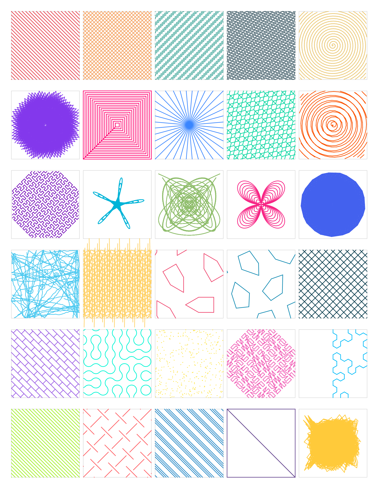

# rat-king

**Blazing-fast fill pattern generation for pen plotters.** Written in Rust for maximum performance.



## Performance

rat-king processes complex SVGs in milliseconds:

```
Essex.svg (314 polygons)
├── Python/Shapely:  ~32,000ms (32 seconds)
└── Rust rat-king:      ~159ms (0.16 seconds)

Speedup: 200x faster
```

## Installation

### From crates.io (recommended)

```bash
cargo install rat-king-cli
```

This installs the `rat-king` binary to `~/.cargo/bin/`.

### From source

```bash
git clone https://github.com/dirtybirdnj/rat-king
cd rat-king/crates
cargo build --release
./target/release/rat-king --help
```

### As a library dependency

```toml
# In your Cargo.toml
[dependencies]
rat-king = "0.1"
```

Or from git:

```toml
[dependencies]
rat-king = { git = "https://github.com/dirtybirdnj/rat-king" }
```

## Usage

### TUI (Interactive Mode)

```bash
rat-king                      # Opens TUI with default test file
rat-king myfile.svg           # Opens TUI with your SVG
```

**TUI Controls:**
- `↑`/`↓` or `j`/`k` - Select pattern
- `←`/`→` or `h`/`l` - Adjust setting (fine)
- `[`/`]` - Adjust setting (coarse)
- `Tab` - Switch between spacing/angle
- `q` or `Esc` - Quit

### CLI Commands

```bash
# Fill shapes with a pattern
rat-king fill input.svg -p crosshatch -o output.svg

# Apply sketchy/hand-drawn effect (RoughJS-style)
rat-king fill input.svg -p lines --sketchy -o output.svg

# Include polygon outlines with pattern fill
rat-king fill input.svg -p lines --strokes -o output.svg

# Full sketchy example with custom parameters
rat-king fill input.svg -p crosshatch --sketchy --roughness 2.0 --bowing 1.5 --strokes -o output.svg

# Benchmark a pattern
rat-king benchmark input.svg -p gyroid

# Run test harness with visual analysis
rat-king harness input.svg --analyze --json -o results/

# List all available patterns
rat-king patterns

# Analyze SVG structure (for AI agents)
rat-king analyze large.svg                      # Quick summary stats
rat-king analyze large.svg --json               # Machine-readable JSON
rat-king analyze large.svg --tree --depth 3     # Group hierarchy
rat-king analyze large.svg --sample 5           # Sample paths
rat-king analyze large.svg --color "#FF0000"    # Find elements by color
rat-king analyze large.svg --layer "Background" # Layer stats
rat-king analyze large.svg --region "0,0,100,100"  # Elements in region
```

### Analyze Command (AI Agent Support)

The `analyze` command helps AI agents inspect large SVG files (15MB-150MB) without token overload:

| Option | Description |
|--------|-------------|
| `--json` | Output as JSON (default: human-readable) |
| `--tree` | Show group hierarchy with element counts |
| `--depth N` | Limit tree depth |
| `--sample N` | Get N evenly-sampled paths with metadata |
| `--color "#HEX"` | Find elements with specific fill/stroke color |
| `--layer "ID"` | Get stats for a specific layer/group |
| `--region "x,y,w,h"` | Find elements within bounding box |
| `--id "ID"` | Get detailed info for a specific element |

**Example output:**
```
SVG Analysis
============

File: 15.2 MB
viewBox: 0 0 1920 1080

Elements (4523 total):
  paths: 3891
  groups: 412

Structure:
  transforms: 234
  top-level groups: 5
    - Background (1203 children)
    - Layer_1 (892 children)

Fill colors (23 unique):
  #ff0000 (456x)
  #00ff00 (234x)
```

### Sketchy Effect Options

The `--sketchy` flag applies a hand-drawn effect (inspired by [RoughJS](https://roughjs.com/)):

| Option | Description | Default |
|--------|-------------|---------|
| `--sketchy` | Enable sketchy mode | - |
| `--roughness <n>` | Endpoint randomization | 1.0 |
| `--bowing <n>` | Line curvature amount | 1.0 |
| `--no-double-stroke` | Disable double-line effect | - |
| `--seed <n>` | Random seed for reproducibility | - |
| `--strokes` | Include polygon outlines | - |

## Available Patterns (30 total)

| Pattern | Description | Coverage | Visual Style |
|---------|-------------|----------|--------------|
| `lines` | Parallel line hatching | Excellent (99%) | Classic crosshatch base |
| `crosshatch` | Two perpendicular line sets | Excellent (99%) | X pattern |
| `zigzag` | Connected angular waves | Excellent (99%) | Lightning bolt |
| `wiggle` | Smooth sinusoidal waves | Excellent (99%) | Wavy lines |
| `spiral` | Archimedean spiral from center | Excellent (99%) | Single arm spiral |
| `fermat` | Fermat (sqrt radius) spiral | Good (77%) | Dense center spiral |
| `concentric` | Nested polygon outlines | N/A | Shrinking shells |
| `radial` | Lines radiating from center | Poor (44%) | Sunburst |
| `honeycomb` | Hexagonal grid | Excellent (90%) | Beehive cells |
| `crossspiral` | Two opposing spirals | Excellent (95%) | CW + CCW arms |
| `hilbert` | Space-filling curve | Excellent (91%) | Recursive maze |
| `guilloche` | Spirograph hypotrochoid | Poor (15%) | Currency-style |
| `lissajous` | Oscilloscope curves | Fair (63%) | Figure-8s |
| `rose` | Flower petal curves | Poor (33%) | Rhodonea petals |
| `phyllotaxis` | Golden angle sunflower | Fair (65%) | Fibonacci spirals |
| `scribble` | Organic random walk | N/A | Hand-drawn look |
| `gyroid` | 3D minimal surface | N/A | Flowing contours |
| `pentagon15` | Type 15 pentagonal tiling | Poor (36%) | Aperiodic tiles |
| `pentagon14` | Type 14 pentagonal tiling | Poor (42%) | Aperiodic tiles |
| `grid` | Orthogonal crosshatch | Excellent (99%) | Square grid |
| `brick` | Offset rectangular tiling | Excellent (99%) | Brick wall |
| `truchet` | Quarter-circle tiles | Good (85%) | Maze-like curves |
| `stipple` | Poisson disk stippling | Excellent (98%) | Dots/points |
| `peano` | Peano space-filling curve | Excellent (99%) | Recursive maze |
| `sierpinski` | Sierpinski triangle | Poor (24%) | Fractal triangles |
| `diagonal` | 45° parallel lines | Excellent (99%) | Angled hatching |
| `herringbone` | V-shaped brick pattern | Fair (58%) | Zigzag bricks |
| `stripe` | Horizontal parallel lines | Excellent (98%) | Classic hatching |
| `tessellation` | Tiled pattern | Fair (52%) | Geometric tiles |
| `harmonograph` | Pendulum simulation curves | Good (75%) | Spirograph-like |

*Coverage ratings are based on test harness analysis at spacing=2.5, angle=45°*

## Architecture

```
rat-king/
├── crates/                    # Rust workspace
│   ├── rat-king/              # Pattern generation library (the dependency)
│   │   └── src/
│   │       ├── patterns/      # 29 pattern implementations
│   │       ├── geometry.rs    # Point, Line, Polygon types
│   │       ├── clip.rs        # Point-in-polygon clipping
│   │       └── hatch.rs       # Line generation utilities
│   └── rat-king-cli/          # CLI/TUI binary
│       └── src/main.rs        # TUI + fill, benchmark, harness, patterns commands
├── docs/                      # Documentation and assets
│   ├── all_patterns_color.png # Pattern reference (colorful)
│   ├── all_patterns.png       # Pattern reference (B&W)
│   └── all_patterns.pdf       # Pattern reference PDF
└── test_assets/               # Test SVGs (public domain)
    └── essex.svg              # 314 polygons - USGS county boundaries
```

## Adding a New Pattern

### The Golden Path

Contributors only need to focus on the math - we provide everything else:

- **Test geometry included**: `essex.svg` has 314 complex polygons (USGS county data)
- **Instant visual feedback**: TUI shows your pattern in real-time
- **No art hunting**: Just clone, code, and see it work

```bash
git clone https://github.com/dirtybirdnj/rat-king
cd rat-king/crates
cargo run --release  # Opens TUI with essex.svg - your canvas is ready!
```

### Step-by-Step Guide

**1. Create the pattern file**

```bash
touch crates/rat-king/src/patterns/mypattern.rs
```

**2. Implement the pattern**

```rust
//! MyPattern fill - description of what it does.

use crate::geometry::{Line, Polygon};
use crate::clip::point_in_polygon;

/// Generate mypattern fill for a polygon.
///
/// Parameters:
/// - `spacing`: Controls density/scale of the pattern
/// - `angle_degrees`: Rotation or variation parameter
pub fn generate_mypattern_fill(
    polygon: &Polygon,
    spacing: f64,
    angle_degrees: f64,
) -> Vec<Line> {
    let Some((min_x, min_y, max_x, max_y)) = polygon.bounding_box() else {
        return Vec::new();
    };

    let mut lines = Vec::new();

    // Your pattern generation logic here...
    // Use point_in_polygon() to clip to the shape

    lines
}

#[cfg(test)]
mod tests {
    use super::*;
    use crate::geometry::Point;

    #[test]
    fn generates_mypattern_lines() {
        let poly = Polygon::new(vec![
            Point::new(0.0, 0.0),
            Point::new(100.0, 0.0),
            Point::new(100.0, 100.0),
            Point::new(0.0, 100.0),
        ]);
        let lines = generate_mypattern_fill(&poly, 5.0, 0.0);
        assert!(!lines.is_empty());
    }
}
```

**3. Register the module** in `crates/rat-king/src/patterns/mod.rs`:

```rust
mod mypattern;
pub use mypattern::generate_mypattern_fill;
```

**4. Add to the Pattern enum** in the same file:

```rust
pub enum Pattern {
    // ... existing patterns ...
    Mypattern,
}

impl Pattern {
    pub fn all() -> &'static [Pattern] {
        &[
            // ... existing patterns ...
            Pattern::Mypattern,
        ]
    }

    pub fn name(&self) -> &'static str {
        match self {
            // ... existing patterns ...
            Pattern::Mypattern => "mypattern",
        }
    }

    pub fn from_name(name: &str) -> Option<Pattern> {
        match name.to_lowercase().as_str() {
            // ... existing patterns ...
            "mypattern" => Some(Pattern::Mypattern),
            _ => None,
        }
    }

    // Add to the generate() method match:
    pub fn generate(&self, polygon: &Polygon, spacing: f64, angle: f64) -> Vec<Line> {
        match self {
            // ... existing patterns ...
            Pattern::Mypattern => generate_mypattern_fill(polygon, spacing, angle),
        }
    }
}
```

**5. Run tests and verify**

```bash
cd crates
cargo test
cargo run --release -- patterns  # Should list your new pattern
cargo run --release              # Test in TUI
```

**7. Submit your pattern**

```bash
git checkout -b add-mypattern
git add -A
git commit -m "Add mypattern fill pattern"
git push origin add-mypattern
# Open a pull request
```

## Versioning & Updates

### For App Developers

**Using the binary (svg-grouper, etc.):**

```bash
# Check current version
rat-king --help  # Shows version in output

# Update to latest
cargo install rat-king-cli --force
```

**Using the library:**

```toml
# Cargo.toml - pin to minor version for stability
rat-king = "0.1"

# Or always get latest
rat-king = "*"
```

Update with:
```bash
cargo update
```

### Release Process (for maintainers)

1. Update version in `crates/Cargo.toml` (workspace version)
2. Update CHANGELOG if present
3. Commit: `git commit -m "Release v0.2.0"`
4. Tag: `git tag v0.2.0`
5. Push: `git push && git push --tags`
6. Publish:
   ```bash
   cd crates/rat-king && cargo publish
   cd ../rat-king-cli && cargo publish
   ```

### Semantic Versioning

- **Patch (0.1.x)**: Bug fixes, performance improvements
- **Minor (0.x.0)**: New patterns, new features (backward compatible)
- **Major (x.0.0)**: Breaking API changes

New patterns = minor version bump. Apps using `rat-king = "0.1"` will automatically get new patterns on `cargo update`.

## Integration Examples

### Python (subprocess)

```python
import subprocess
import json

result = subprocess.run([
    "rat-king", "fill", "input.svg",
    "-p", "crosshatch",
    "-s", "2.5",
    "-a", "45",
    "-o", "output.svg"
], capture_output=True, text=True)
```

### Rust (library)

```rust
use rat_king::{Pattern, extract_polygons_from_svg};
use rat_king::patterns::generate_lines_fill;

let svg = std::fs::read_to_string("input.svg")?;
let polygons = extract_polygons_from_svg(&svg)?;

for poly in &polygons {
    let lines = generate_lines_fill(poly, 2.5, 45.0);
    // Use lines...
}
```

## Development

```bash
cd crates
cargo build --release    # Build optimized binary
cargo test               # Run all tests
cargo run --release      # Run TUI
cargo run --release -- benchmark test_assets/essex.svg -p lines
```

## Why Rust?

The original Python implementation using Shapely was clean but slow:
- Complex polygons took 30+ seconds
- Interactive tools were unusable

Rust gives us:
- 200x speedup (milliseconds instead of seconds)
- Zero-copy geometry operations
- Native TUI with real-time pattern preview
- Single binary distribution
- Easy cross-platform builds

## Related Projects

- [svg-grouper](https://github.com/dirtybirdnj/svg-grouper) - GUI for plotter SVG prep
- [vpype](https://github.com/abey79/vpype) - Swiss-army knife for plotter workflows

## License

MIT
